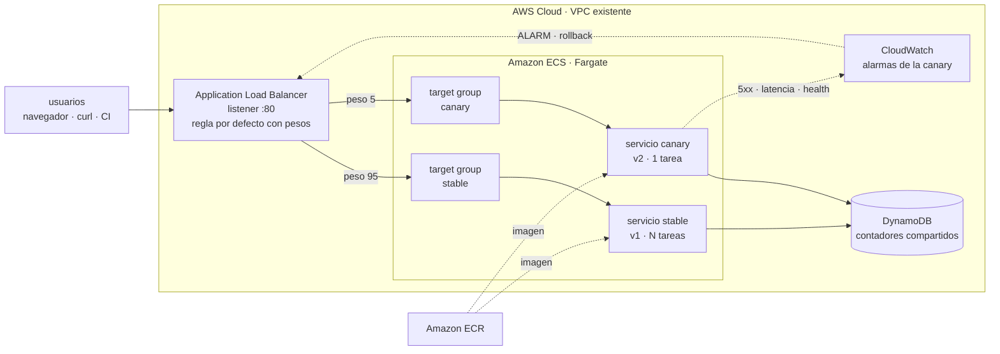

# ECS Canary in Action

Laboratorio completo de **despliegues canary en Amazon ECS Fargate**, con una app
que además funciona como **monitor de tráfico en vivo**: ves en el navegador cómo
se reparten las peticiones entre la versión estable y la canary, mientras mueves
los pesos del balanceador.

Con Terraform podés arrancar sin nada de red previo: crea una VPC mínima solo
para el laboratorio. Si ya tenés una VPC (con cualquiera de los tres sabores),
la usa directamente y no crea red nueva.


```
BUILD · DEPLOY · EVOLVE
```

---

## Qué vas a practicar

- Repartir tráfico real con **weighted target groups** de un ALB (95/5, 75/25, 50/50, 100/0).
- Ver el reparto **en vivo**, comparando lo que pediste con lo que realmente pasa.
- **Romper la canary a propósito** y ver cómo las alarmas de CloudWatch disparan
  el **rollback automático**.
- Hacer lo mismo con **tres sabores de IaC**: Terraform, CloudFormation y CDK.
- Encadenarlo todo en **CI/CD con GitHub Actions** usando OIDC, sin claves de acceso.

---

## Arquitectura



El único elemento que mueve tráfico es **la regla por defecto del listener**.
Las dos versiones corren siempre; lo que cambia es el peso que reciben.

### Por qué esta arquitectura

- **Rollback instantáneo.** Volver atrás es reescribir dos números en el listener.
  No hay que bajar imágenes ni arrancar tareas, así que tarda segundos.
- **Las dos versiones son observables al mismo tiempo.** Puedes comparar latencia
  y errores de v1 y v2 con tráfico real de producción.
- **Las alarmas apuntan solo al target group de la canary.** Si la versión nueva
  falla, las métricas de la estable no lo disimulan.

---

## Requisitos

| Herramienta | Para qué | Mínimo |
|---|---|---|
| `aws` CLI v2 | todo lo de AWS | 2.x |
| `jq` | los scripts parsean JSON | 1.6 |
| `docker` | construir la imagen y el laboratorio local | 20+ |
| `bash` | los scripts | 3.2 (el de macOS sirve) |
| `terraform` | solo el sabor Terraform | 1.6+ |
| `node` + `npm` | solo el sabor CDK y el modo dev | 20+ |

En AWS necesitas permisos para crear ALB, ECS, ECR, DynamoDB, CloudWatch y roles
IAM. Si vas a usar tu propia VPC (o el sabor CloudFormation/CDK), necesitás
además una **VPC con al menos dos subnets públicas en zonas distintas**, que es
lo que el ALB exige.

```bash
brew install awscli jq terraform   # macOS
```

---

## Ruta rápida 1: local, sin cuenta de AWS

Levanta un ALB de juguete (`local/mini-alb`) que imita el comportamiento del real:
pesos, routing forzado, health checks y 503 cuando no hay targets sanos.

```bash
make local
open http://localhost:8080
```

| URL | Qué es |
|---|---|
| http://localhost:8080 | el dashboard, detrás del balanceador |
| http://localhost:8081 | la versión estable, directo |
| http://localhost:8082 | la versión canary, directo |

Ahora mueve el tráfico y mira el dashboard:

```bash
./scripts/weights.sh --target local --canary 5     # 5% a la canary
./scripts/weights.sh --target local --canary 50    # mitad y mitad

./scripts/traffic-gen.sh --url http://localhost:8080 --requests 200
#   stable     190 requests (95%)
#   canary     10 requests (5%)

./scripts/chaos.sh --url http://localhost:8080 --break   # rompe la canary
./scripts/chaos.sh --url http://localhost:8080 --clear   # arréglala

make local-down
```

Esto es exactamente el flujo que corre en CI en cada pull request.

---

## Ruta rápida 2: en AWS

El sabor Terraform tiene dos modos de red, con `vpc_id` como único interruptor:

- **Sin nada que configurar (por defecto).** Dejás `vpc_id` vacío y Terraform crea
  una VPC mínima solo para el laboratorio: subnets públicas, internet gateway,
  listo. Ideal para probar rápido o en una cuenta nueva.
- **Con tu propia VPC.** Si ya tenés una (como en la mayoría de las cuentas con
  algo de uso), pasás `vpc_id` y las subnets, y Terraform no crea nada de red:
  usa la que le indicaste.

CloudFormation y CDK todavía solo soportan el segundo modo (VPC existente
obligatoria); si preferís esos sabores, saltá directo al paso 0.

### Paso 0. Si vas a usar tu propia VPC, buscá sus datos

```bash
aws ec2 describe-vpcs \
  --query 'Vpcs[].{Id:VpcId,Cidr:CidrBlock,Name:Tags[?Key==`Name`]|[0].Value}'

aws ec2 describe-subnets --filters Name=vpc-id,Values=<tu-vpc-id> \
  --query 'Subnets[].{Id:SubnetId,Az:AvailabilityZone,Public:MapPublicIpOnLaunch}'
```

Si vas a dejar que Terraform cree la VPC, saltá directo al paso 1.

### Paso 1. Publica la primera imagen

El registro va **antes** que la infraestructura: un servicio de ECS no arranca sin
una imagen que correr.

```bash
make push TAG=v1
```

Crea el repositorio de ECR si no existe y sube la imagen construida para
`linux/amd64` (así funciona aunque compiles en un Mac con Apple silicon).

### Paso 2. Elige un sabor de IaC

<details open>
<summary><b>Terraform</b> (recomendado para este laboratorio)</summary>

**Sin VPC propia** (Terraform crea una mínima):

```bash
cd infra/terraform
terraform init
terraform apply   # sin tfvars: usa la VPC que Terraform crea por defecto
cd ../..

./scripts/load-env.sh terraform
```

**Con tu propia VPC:**

```bash
cd infra/terraform
cp terraform.tfvars.example terraform.tfvars
# descomenta vpc_id y public_subnet_ids, y pega los datos del paso 0
terraform init
terraform apply
cd ../..

./scripts/load-env.sh terraform
```

Es el único sabor con `ignore_changes` sobre los pesos y el `desired_count`, así
que un `terraform apply` a mitad de un rollout no te pisa el reparto de tráfico.

La VPC creada por defecto es deliberadamente simple: solo subnets públicas, sin
NAT gateway. Sirve para el laboratorio; para algo que viva más tiempo, usa tu
propia VPC con subnets privadas.
</details>

<details>
<summary><b>CloudFormation</b></summary>

```bash
cd infra/cloudformation
cp params.example.json params.json
# edita VpcId y PublicSubnetIds
./deploy.sh --stack-name canary-lab
cd ../..

./scripts/load-env.sh cloudformation --stack canary-lab
```

Para actualizar el stack mientras hay un rollout en curso, usa
`./deploy.sh --keep-weights`: lee los pesos vivos y los vuelve a pasar como
parámetros, en lugar de resetearlos a 100/0.
</details>

<details>
<summary><b>CDK (TypeScript)</b></summary>

```bash
cd infra/cdk
npm install
npx cdk deploy \
  -c vpcId=vpc-0123456789abcdef0 \
  -c publicSubnetIds=subnet-0aaa,subnet-0bbb
cd ../..

./scripts/load-env.sh cdk --stack canary-lab
```

También puedes dejar esos valores fijos en el bloque `context` de `cdk.json` y
correr `npx cdk deploy` a secas.
</details>

### Paso 3. Abre el dashboard

```bash
./scripts/status.sh
```

Te imprime la URL del ALB, el reparto actual, el estado de las tareas, la salud de
los targets y las alarmas.

---

## El dashboard

La app se sirve a sí misma y **se mide a sí misma**. La página manda sondas a
`/api/hit` desde tu navegador, así que el reparto que ves es tráfico real pasando
por el balanceador, no una simulación.

Tres barras, que es lo interesante:

| Barra | Qué significa |
|---|---|
| **Peso configurado en el ALB** | lo que pediste: los pesos del listener, leídos en vivo |
| **Observado por tu navegador** | lo que realmente te está pasando a ti |
| **Global (todas las tareas)** | lo que le pasa a todo el mundo, contado en DynamoDB |

Con pocas peticiones las tres difieren; al subir el ritmo convergen. Ese es el
momento didáctico: **los pesos son probabilidad, no un reparto exacto**.

Además tiene: tira de las últimas 120 sondas (color por versión, rojo si dio 5xx),
tarjetas por versión con latencia y tasa de error, gráfico por minuto, flujo de
peticiones en vivo, y una **sala de control** para inyectar fallos.

### El mismo dato, en CloudWatch

Si preferís verlo desde la consola de AWS en vez del navegador, el sabor
Terraform también crea un dashboard de CloudWatch (`<proyecto>-canary`) con un
widget dedicado al **porcentaje de tráfico de la canary**, calculado con metric
math a partir de los `RequestCount` reales de cada target group
(`100 * canary / (stable + canary)`). Es el mismo número que las barras del
dashboard de la app, pero mirado desde el lado de la infraestructura, útil para
correlacionar el reparto con las alarmas y los logs sin salir de la consola.

```bash
terraform output cloudwatch_dashboard_url
```

Para ver una versión concreta sin tocar los pesos:

```bash
curl "http://$ALB/?track=canary"          # por query string
curl -H 'X-Canary: always' "http://$ALB/" # por header
```

---

## Demo A: el rollout que sale bien

```bash
make push TAG=v2
./scripts/canary-deploy.sh --tag v2
```

Lo que hace, en orden:

1. Registra una task definition de la canary con la imagen nueva.
2. Escala el servicio canary y espera **targets sanos** de verdad.
3. Limpia el estado viejo de las alarmas.
4. Mueve los pesos: **5% → 25% → 50% → 100%**, y entre cada paso **hornea**
   90 segundos vigilando las alarmas.
5. Si todo está en orden, **promueve**: la estable pasa a la imagen nueva, el
   tráfico vuelve a 100% estable y la canary baja a cero.

Si alguna alarma salta en cualquier momento, el script **revierte solo** y termina
con error.

Mientras corre, en otra terminal:

```bash
make watch                                    # estado refrescándose
./scripts/traffic-gen.sh --rps 15 --duration 300
```

Variantes útiles:

```bash
./scripts/canary-deploy.sh --tag v2 --steps 10,100 --bake 60   # más rápido
./scripts/canary-deploy.sh --tag v2 --no-promote               # se queda al 100% canary
./scripts/canary-deploy.sh --tag v2 --dry-run                  # solo el plan
```

## Demo B: el rollback automático

Esta es la que hay que mostrar en vivo.

```bash
# Terminal 1
make watch

# Terminal 2
./scripts/weights.sh --canary 25
./scripts/chaos.sh --break        # 50% de 5xx y 1200 ms extra, solo en la canary
```

En un par de minutos: el gráfico se llena de rojo, `canary-lab-canary-5xx` y
`canary-lab-canary-latency` pasan a **ALARM**, y si tenías un rollout corriendo
ese rollout vuelve el tráfico a la estable solo.

A mano:

```bash
./scripts/rollback.sh       # tráfico a 100% estable, ya
./scripts/chaos.sh --clear  # arregla la canary
```

Otros fallos que puedes inyectar:

```bash
./scripts/chaos.sh --fail-rate 100                 # todo 500
./scripts/chaos.sh --latency 2500                  # revienta el presupuesto de latencia
./scripts/chaos.sh --unhealthy                     # falla el health check
./scripts/chaos.sh --track stable --fail-rate 10   # rompe la estable, para variar
```

El estado del chaos vive en DynamoDB y lo consultan **todas** las tareas, así que
afecta a la versión entera y no solo al contenedor que te respondió.

---

## Comandos

```bash
make help
```

| Comando | Qué hace |
|---|---|
| `make local` / `make local-down` | laboratorio local con docker compose |
| `make push TAG=v2` | construye y sube la imagen |
| `make status` / `make watch` | estado del despliegue |
| `make canary TAG=v2` | rollout progresivo con rollback automático |
| `make weights CANARY=25` | mueve el tráfico a mano |
| `make traffic RPS=20` | genera carga y reporta el reparto observado |
| `make break` / `make fix` | inyecta y limpia fallos |
| `make rollback` | todo el tráfico a la estable |
| `make promote TAG=v2` | promueve una versión a estable |
| `make lint` | shellcheck, terraform, cfn, cdk y node |
| `make clean` | borra artefactos locales y `.canary.env` |

Cada script acepta `--help` y explica sus opciones.

### El archivo `.canary.env`

`load-env.sh` traduce las salidas de tu IaC a un contrato único
(`CANARY_CLUSTER`, `CANARY_LISTENER_ARN`, `CANARY_TG_CANARY`, ...) que el resto de
los scripts lee. Por eso los mismos comandos funcionan con los tres sabores.
Vuelve a generarlo después de cada cambio de infraestructura:

```bash
make env FLAVOUR=terraform
```

---

## CI/CD con GitHub Actions

| Workflow | Cuándo | Qué hace |
|---|---|---|
| `ci.yml` | push y PR | lint de todo, build de la imagen, y **el flujo canary completo** en local: comprueba que al 50/50 el tráfico se reparte, que el chaos solo afecta a la canary, y que una canary enferma sale de rotación sin tirar el servicio |
| `deploy-canary.yml` | manual | build, push y rollout progresivo con rollback automático |
| `rollback.yml` | manual | botón de pánico |
| `infra-terraform.yml` | PR y manual | `fmt`, `validate`, `plan` en el PR y `apply` del plan revisado |

`ci.yml` no necesita credenciales de AWS: corre entero en el runner, así que
funciona también en forks.

### Configuración, una vez

```bash
# 1. Rol con OIDC (sin claves de acceso)
aws cloudformation deploy \
  --template-file infra/github-oidc/oidc-role.yaml \
  --stack-name canary-lab-github-oidc \
  --capabilities CAPABILITY_NAMED_IAM \
  --parameter-overrides GitHubOrg=roxsross GitHubRepo=aws-ecs-canary-in-action

ROLE_ARN=$(aws cloudformation describe-stacks \
  --stack-name canary-lab-github-oidc \
  --query 'Stacks[0].Outputs[?OutputKey==`RoleArn`].OutputValue' --output text)

# 2. Secret y variables del repo
gh secret set AWS_ROLE_ARN --body "$ROLE_ARN"
gh variable set AWS_REGION --body us-east-1
gh variable set PROJECT_NAME --body canary-lab
gh variable set IAC_FLAVOUR --body terraform
gh variable set STACK_NAME --body canary-lab
```

Luego:

```bash
gh workflow run deploy-canary.yml -f tag=v2 -f steps=5,25,50,100 -f bake=90
gh workflow run rollback.yml
```

Con `-f promote=manual` el rollout se detiene al 100% de canary y la promoción
espera en el environment `production`. Si le pones **reviewers** a ese environment,
tienes una aprobación humana antes de que la versión nueva sea la oficial.

El rol trae dos alcances: `deploy` (por defecto, permisos ajustados para empujar
imágenes y mover tráfico) e `infrastructure` (amplio, incluye crear roles IAM).
Usa el primero salvo que quieras que el pipeline cree el stack entero.

---

## Diferencias entre los tres sabores

Los tres crean lo mismo (ALB, ECS, DynamoDB, alarmas) y exponen las mismas
salidas. Hay dos diferencias que importan:

| | Terraform | CloudFormation | CDK |
|---|---|---|---|
| Red | crea una VPC mínima por defecto, o usa la tuya si pasás `vpc_id` | siempre necesita una VPC existente | siempre necesita una VPC existente |
| Pesos del listener tras actualizar a medio rollout | protegidos con `ignore_changes` | los reescribe, salvo `deploy.sh --keep-weights` | los reescribe, salvo `-c stableWeight/-c canaryWeight` |
| `desired_count` de la canary | protegido | lo reescribe | lo reescribe |
| Task definition en uso | protegida | la reescribe | la reescribe |
| Necesita credenciales para validar | no (`validate`) | no (`cfn-lint`) | no (`synth`) |

Lo de los pesos no es un defecto de CloudFormation ni de CDK: el modelo
declarativo hace justo lo que le pediste. Solo hay que saberlo y pasar los
valores actuales al actualizar.

---

## Costos

Estimación en `us-east-1` con la configuración por defecto (2 tareas estables de
0.25 vCPU, ALB, DynamoDB on-demand, 4 alarmas):

| Recurso | Aproximado |
|---|---|
| Application Load Balancer | USD 0,023 / hora |
| Fargate, 2 tareas | USD 0,025 / hora |
| DynamoDB, CloudWatch, logs | centavos con tráfico de laboratorio |
| **Total** | **≈ USD 0,05 / hora, ≈ USD 35 / mes** |

El ALB cobra aunque no haya tráfico. **Destruye el laboratorio cuando termines.**
Los precios cambian por región; confirma en la calculadora de AWS.

---

## Limpieza

```bash
make tf-destroy        # Terraform
make cfn-destroy       # CloudFormation
make cdk-destroy       # CDK
```

El repositorio de ECR se borra con las imágenes dentro (`force_delete` /
`EmptyOnDelete`). Si lo creó `build-push.sh` y no tu IaC, bórralo aparte:

```bash
aws ecr delete-repository --repository-name canary-lab-app --force
```

---

## Seguridad: lee esto antes de dejarlo encendido

Este repositorio es material didáctico y sus valores por defecto priorizan que
puedas compartir el dashboard con tu audiencia:

- **El ALB escucha en HTTP y acepta `0.0.0.0/0`.** Limítalo a tu IP con
  `allowed_ingress_cidrs = ["TU.IP/32"]` (Terraform) o `AllowedIngressCidr`
  (CloudFormation / CDK). Para algo serio, pon HTTPS con ACM delante.
- **`/api/chaos` y `/api/reset` no piden autenticación.** Cualquiera que llegue al
  ALB puede romper tu canary. Define `admin_token` / `AdminToken` y los endpoints
  empezarán a exigir la cabecera `X-Admin-Token`.
- **El token viaja como variable de entorno de la task definition**, visible en la
  consola. Para un secreto real, usa Secrets Manager con `valueFrom`.
- Las tareas salen a internet con `assign_public_ip = true` para poder bajar la
  imagen sin NAT gateway. Es lo más barato, no lo más aislado: en producción usa
  subnets privadas con NAT o VPC endpoints. Cuando Terraform crea la VPC por
  defecto, esto queda forzado (no hay NAT en esa VPC mínima).

---

## Si algo no funciona

| Síntoma | Causa probable |
|---|---|
| Las tareas arrancan y mueren en bucle | la imagen no existe con ese tag, o la construiste para `arm64` y el stack espera `X86_64`. Revisa `cpu_architecture` y usa `--platform linux/amd64` |
| `503` desde el ALB | no hay targets sanos. `./scripts/status.sh` y mira `healthy=` |
| El dashboard dice "dynamodb (degradado)" | la tabla no existe o al rol de la tarea le falta permiso. Los contadores pasan a ser locales por tarea |
| El peso del ALB sale como "estimado" | falta `LISTENER_ARN` o el permiso `elasticloadbalancing:DescribeRules` |
| `missing environment: CANARY_...` | falta `.canary.env`. Corre `make env FLAVOUR=...` |
| El rollout revierte enseguida | había una alarma en ALARM de una demo anterior. El script las limpia salvo que uses `--no-reset-alarms` |
| `terraform apply` quiere recrear el listener | normal si cambiaste los pesos a mano y usas otro sabor. En Terraform están protegidos |

Logs de la aplicación:

```bash
aws logs tail /ecs/canary-lab --since 15m --follow
aws logs tail /ecs/canary-lab --since 1h --filter-pattern canary
```

---

## Estructura

```
app/                  la aplicación y el dashboard (Node, sin build step)
  src/                servidor, store de DynamoDB, chaos, métricas EMF
  public/             dashboard: HTML, CSS y JS a mano, sin dependencias
infra/
  terraform/          sabor Terraform
  cloudformation/     sabor CloudFormation + deploy.sh
  cdk/                sabor CDK en TypeScript
  github-oidc/        rol de OIDC para GitHub Actions
scripts/              el flujo canary: weights, canary-deploy, rollback, chaos...
local/                laboratorio sin AWS: mini-alb + docker compose
docs/                 arquitectura a fondo y runbook de operación
.github/workflows/    CI y CD
```

Más detalle en [docs/architecture.md](docs/architecture.md) y el runbook en
[docs/canary-playbook.md](docs/canary-playbook.md).

---

## Licencia

MIT. Úsalo en tus charlas, cursos y workshops.
