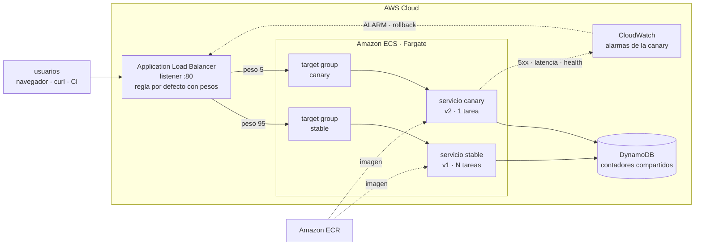

# ECS Canary in Action

Laboratorio de **despliegues canary en Amazon ECS Fargate**. La app que se
despliega funciona además como **monitor de tráfico en vivo**: en el navegador
ves cómo se reparten las peticiones entre la versión estable y la canary,
mientras movés los pesos del balanceador.

[](https://github.com/roxsross/aws-ecs-canary-in-action/actions/workflows/ci.yml)
[](https://github.com/roxsross/aws-ecs-canary-in-action/actions/workflows/infra-terraform.yml)
[](infra/terraform)
[](app/package.json)
[](infra/terraform)
[](https://trivy.dev)
[](LICENSE)

```
BUILD · DEPLOY · EVOLVE
```

## Qué vas a practicar

- Repartir tráfico real con **weighted target groups** de un ALB (95/5, 50/50, 100/0).
- Ver la distribución **en vivo**, comparando lo que pediste con lo que realmente pasa.
- **Simular un incidente de forma controlada** y ver cómo las alarmas de
  CloudWatch disparan el **rollback automático**.
- Todo esto en **CI/CD con GitHub Actions**, usando OIDC (sin claves de acceso).

## Arquitectura



El único elemento que mueve tráfico es la regla por defecto del listener. Las
dos versiones corren siempre; lo que cambia es el peso que reciben. Eso hace que
el rollback sea instantáneo (reescribir dos números) y que las dos versiones
sean observables al mismo tiempo con tráfico real.

Más detalle de diseño en [docs/architecture.md](docs/architecture.md) y el
runbook operativo en [docs/canary-playbook.md](docs/canary-playbook.md).

## Requisitos

| Herramienta | Para qué |
|---|---|
| `aws` CLI v2 | todo lo de AWS |
| `jq` | los scripts parsean JSON |
| `docker` | construir la imagen y el laboratorio local |
| `terraform` 1.6+ | desplegar en AWS |
| `node` 20+ | el modo dev (`make dev`) |
| `trivy` | análisis de seguridad de la infraestructura (`make lint-trivy`) |

```bash
brew install awscli jq terraform trivy   # macOS
```

En AWS necesitás permisos para crear ALB, ECS, ECR, DynamoDB, CloudWatch y roles
IAM.

Si trabajás con un asistente de IA sobre este repo, `.kiro/settings/mcp.json`
configura el [servidor MCP oficial de Terraform](https://developer.hashicorp.com/terraform/mcp-server)
(HashiCorp, corre en Docker, sin token), para que el asistente consulte la
documentación más reciente de providers y módulos del registro público.

## Quickstart 1: local, sin cuenta de AWS

`make local` levanta con `docker compose` el mismo laboratorio, sin AWS:

- **mini-alb** (`local/mini-alb/server.js`): un balanceador de juguete que
  imita al ALB real — reparte tráfico por peso, expone routing forzado y
  devuelve 503 cuando no hay targets sanos.
- **stable** y **canary**: dos contenedores de la misma app (`app/`), cada uno
  con su `TRACK`/`APP_VERSION`, igual que los dos servicios ECS reales.
- **dynamodb-local**: la misma tabla de contadores que en AWS, pero en memoria
  y sin costo.

Es la misma arquitectura del diagrama de arriba a escala de laptop, y es
exactamente el flujo que corre en CI en cada pull request.

```bash
make local
open http://localhost:8080
```

| URL | Qué es |
|---|---|
| http://localhost:8080 | el dashboard, detrás del balanceador |
| http://localhost:8081 | la versión estable, directo |
| http://localhost:8082 | la versión canary, directo |

Mueve el tráfico y mirá el dashboard reaccionar:

```bash
./scripts/weights.sh --target local --canary 5     # 5% a la canary
./scripts/weights.sh --target local --canary 50    # mitad y mitad

./scripts/traffic-gen.sh --url http://localhost:8080 --requests 200
#   stable     190 requests (95%)
#   canary     10 requests (5%)

./scripts/chaos.sh --url http://localhost:8080 --break   # inyecta fallos en la canary
./scripts/chaos.sh --url http://localhost:8080 --clear   # desactiva la inyección de fallos

make local-down
```

## Quickstart 2: desplegar en AWS con Terraform

```bash
cd infra/terraform
terraform init
terraform apply
cd ../..

./scripts/load-env.sh
make push TAG=v1
```

`make push` construye la imagen con `docker buildx` para **linux/amd64 y
linux/arm64** y sube un único manifest multi-arquitectura a ECR. Así el mismo
tag corre en Fargate sin importar si compilaste en Apple silicon, en Intel o en
un runner de CI, ni cuál sea `var.cpu_architecture` en Terraform. Si preferís
un build de una sola arquitectura (más rápido), usá
`./scripts/build-push.sh --tag v1 --platform linux/amd64`, pero entonces esa
plataforma tiene que coincidir con `var.cpu_architecture` en `terraform.tfvars`.

Por defecto, `vpc_id` queda vacío y Terraform crea una VPC mínima solo para el
laboratorio (subnets públicas + internet gateway). Si ya tenés una VPC y
preferís usarla, buscá sus datos y pasáselos por `terraform.tfvars`:

```bash
aws ec2 describe-vpcs --query 'Vpcs[].{Id:VpcId,Cidr:CidrBlock}'
aws ec2 describe-subnets --filters Name=vpc-id,Values=<tu-vpc-id> \
  --query 'Subnets[].{Id:SubnetId,Az:AvailabilityZone,Public:MapPublicIpOnLaunch}'

cp infra/terraform/terraform.tfvars.example infra/terraform/terraform.tfvars
# completá vpc_id y public_subnet_ids con lo que devolvió describe-subnets
```

Con `vpc_id` seteado, Terraform no crea nada de red y usa la tuya.

### Terraform: para qué se usa y qué crea

Todo lo que corre en AWS —red, ALB, ECS, DynamoDB, alarmas— está definido en
[`infra/terraform/`](infra/terraform), sin clics en la consola: el objetivo es
que el mismo laboratorio se pueda levantar y destruir de forma repetible, en tu
cuenta o en la de cualquiera que clone el repo, con `terraform apply` /
`terraform destroy`. `terraform apply` crea:

- **Red**: la VPC del lab o la que referenciaste (ver arriba).
- **ALB** con dos target groups (`stable`, `canary`) y un listener con regla
  ponderada por defecto, más reglas de routing forzado (`?track=`, header
  `X-Canary`).
- **ECS Fargate**: un cluster, dos servicios (`stable` con 2 tareas, `canary`
  con 0 hasta que arranca un rollout), sus task definitions y roles IAM.
- **DynamoDB**: una tabla para los contadores de tráfico que ve el dashboard.
- **CloudWatch**: 4 alarmas sobre el target group de la canary (5xx, latencia
  p95, targets no sanos, tasa de error de la app) y un dashboard
  (`<proyecto>-canary`) con un widget de porcentaje de tráfico calculado con
  metric math.
- **ECR**: el repositorio de la imagen (`build-push.sh` lo crea si no existe;
  con `create_ecr_repository = true` lo maneja Terraform).

`./scripts/load-env.sh` traduce las salidas de Terraform a `.canary.env`, que el
resto de los scripts lee. Volvé a correrlo después de cada `apply`.

Los pesos del listener y el `desired_count` de la canary están protegidos con
`ignore_changes`, así que un `terraform apply` a mitad de un rollout no te pisa
el reparto de tráfico.

## El dashboard

La app se sirve a sí misma y se mide a sí misma: manda solicitudes de prueba a
`/api/hit` desde tu navegador, así que la distribución que ves es tráfico real
pasando por el balanceador.

| Barra | Qué significa |
|---|---|
| **Distribución configurada (ALB)** | los pesos del listener, leídos en vivo |
| **Distribución observada (cliente)** | lo que le está pasando a tu navegador |
| **Distribución global (todas las tareas)** | lo que le pasa a todo el mundo, contado en DynamoDB |

Con pocas peticiones las tres difieren; al subir el ritmo convergen: los pesos
son probabilidad, no una distribución exacta.

Para ver una versión concreta sin tocar los pesos:

```bash
curl "http://$ALB/?track=canary"          # por query string
curl -H 'X-Canary: always' "http://$ALB/" # por header
```

El mismo número (porcentaje de tráfico de la canary) también está en
CloudWatch: `terraform output cloudwatch_dashboard_url`.

## Demo A: el rollout que sale bien

```bash
make push TAG=v2
./scripts/canary-deploy.sh --tag v2
```

1. Registra una task definition de la canary con la imagen nueva.
2. Escala el servicio canary y espera targets sanos de verdad.
3. Limpia el estado viejo de las alarmas.
4. Mueve los pesos **5% → 25% → 50% → 100%**, horneando 90 segundos entre paso
   y paso mientras vigila las alarmas.
5. Si todo está en orden, promueve: la estable pasa a la imagen nueva, el
   tráfico vuelve a 100% estable y la canary baja a cero.

Si una alarma salta en cualquier momento, el script revierte solo y termina con
error. Mientras corre, en otra terminal:

```bash
make watch
./scripts/traffic-gen.sh --rps 15 --duration 300
```

## Demo B: el rollback automático

```bash
# Terminal 1
make watch

# Terminal 2
./scripts/weights.sh --canary 25
./scripts/chaos.sh --break   # inyecta 50% de 5xx y 1200 ms extra, solo en la canary
```

En un par de minutos las alarmas pasan a `ALARM`, y si tenías un rollout
corriendo, vuelve el tráfico a la estable solo.

A mano:

```bash
./scripts/rollback.sh       # tráfico a 100% estable, ya
./scripts/chaos.sh --clear  # desactiva la inyección de fallos
```

## Comandos

```bash
make help
```

| Comando | Qué hace |
|---|---|
| `make local` / `make local-down` | laboratorio local con docker compose |
| `make push TAG=v2` | construye y sube la imagen |
| `make status` / `make watch` | estado del despliegue |
| `make canary TAG=v2` | rollout progresivo con rollback automático |
| `make weights CANARY=25` | mueve el tráfico a mano |
| `make traffic RPS=20` | genera carga y reporta el reparto observado |
| `make break` / `make fix` | inyecta y limpia fallos |
| `make rollback` | todo el tráfico a la estable |
| `make promote TAG=v2` | promueve una versión a estable |
| `make lint` | shellcheck, terraform fmt/validate, node, Trivy |
| `make clean` | borra artefactos locales y `.canary.env` |

Cada script acepta `--help`.

## Pruebas: cómo correrlas y dónde ver el resultado

Hay tres niveles, del más rápido al más completo. Los tres corren en CI en
cada push/PR; podés correr cada uno localmente antes de subir un cambio.

### 1. Lint y validación estática

```bash
make lint          # todo junto
make lint-js        # sintaxis de los .js de app/ y local/
make lint-sh        # shellcheck + bash -n en scripts/*.sh
make lint-tf        # terraform fmt -check y terraform validate
make lint-trivy     # Trivy contra infra/terraform, falla si hay HIGH/CRITICAL
```

Salida esperada: cada paso imprime `ok` o el detalle del error con archivo y
línea. `make lint-tf` termina con `Success! The configuration is valid.` si
Terraform está bien formado; `make lint-trivy` imprime una tabla por archivo
con la cantidad de hallazgos (`0` = limpio).

### 2. Smoke test de la aplicación

Prueba end-to-end contra una instancia real de la app (local, en Docker o en
Fargate): salud, `/api/hit`, agregación de `/api/stats`, un ciclo de inyección
de fallos, `/metrics` y que el dashboard se sirva.

```bash
# contra `make dev` o `make local`
make smoke
# o apuntando a cualquier URL, por ejemplo el ALB real:
make smoke BASE_URL=http://$ALB
```

Salida esperada, línea por línea (`ok` o `FAIL` por cada chequeo) y un resumen
final:

```
smoke testing http://localhost:8080
  ok   GET /api/health returns 200 — track=stable version=1.0.0
  ok   GET /api/config exposes palette and tracks — persistence=memory
  ok   GET /api/hit records traffic and identifies the track — x-track=stable seq=1
  ok   GET /api/stats aggregates the hit — hits=1 series=5 buckets
  ok   chaos round trip (fail 100% then clear) — injected 500 and recovered
  ok   GET /metrics serves prometheus text — exposition format ok
  ok   GET / serves the dashboard — dashboard html ok
7/7 checks passed
```

Un `FAIL` no interrumpe los demás chequeos; al final el proceso termina con
código de salida distinto de cero si hubo al menos uno, así que sirve para CI
y para uso manual por igual.

### 3. Integración del flujo canary completo (sin AWS)

Es el mismo laboratorio local (`make local`), pero automatizado: sube el
mini-ALB + ambas versiones + DynamoDB local, y verifica el comportamiento con
tráfico real en cada paso.

```bash
make local
./scripts/weights.sh --target local --stable 100 --canary 0
./scripts/traffic-gen.sh --url http://localhost:8080 --requests 60 --concurrency 6 --json
./scripts/weights.sh --target local --canary 50
./scripts/traffic-gen.sh --url http://localhost:8080 --requests 200 --concurrency 8 --json
./scripts/chaos.sh --url http://localhost:8080 --track canary --fail-rate 100
./scripts/chaos.sh --url http://localhost:8080 --clear
make local-down
```

`traffic-gen.sh --json` imprime un resumen (`stable`, `canary`, `errors`,
`observedCanaryPercent`) que es lo que se compara contra el rango esperado
(por ejemplo, 50/50 de peso debería caer entre 30% y 70% observado).

### Ver los resultados en GitHub Actions

Los tres niveles corren automáticamente en el workflow **CI**
([`.github/workflows/ci.yml`](.github/workflows/ci.yml)) en cada push y pull
request, sin credenciales de AWS:

- **`lint`**: sintaxis de JS, shellcheck, `terraform fmt`/`validate`, Trivy.
- **`container`**: construye la imagen real, la corre, espera que reporte sana
  y le corre el smoke test.
- **`integration`**: el flujo canary completo contra el laboratorio local
  (los mismos pasos de arriba, con aserciones automáticas).

Para ver el resultado: pestaña **Actions** del repo → el run correspondiente →
cada job muestra sus pasos expandibles con el log completo. El badge de CI al
principio de este README refleja el estado del último run en `main`. Los pasos
de Terraform (`fmt`, `validate`, `plan`) además escriben un resumen legible en
el **Job Summary** de cada ejecución, con el plan completo cuando aplica.

## Si algo no funciona

| Síntoma | Causa probable |
|---|---|
| Las tareas arrancan y mueren en bucle | la imagen no existe con ese tag, o se construyó con `--platform` limitado a una arquitectura que no coincide con `var.cpu_architecture` |
| `503` desde el ALB | no hay targets sanos. `./scripts/status.sh` y mirá `healthy=` |
| El dashboard dice "dynamodb (degradado)" | la tabla no existe o al rol de la tarea le falta permiso |
| El peso del ALB sale como "estimado" | falta `LISTENER_ARN` o el permiso `elasticloadbalancing:DescribeRules` |
| `missing environment: CANARY_...` | falta `.canary.env`. Corré `./scripts/load-env.sh` |
| El rollout revierte enseguida | había una alarma en `ALARM` de una demo anterior; se limpia salvo `--no-reset-alarms` |

```bash
aws logs tail /ecs/canary-lab --since 15m --follow
```

## Estructura

Dos piezas independientes —**aplicación** e **infraestructura**— más los
scripts que las conectan en un flujo de canary real.

```
aws-ecs-canary-in-action/
├── app/                        Aplicación Node.js (Express) — el dashboard y su API
│   ├── src/
│   │   ├── server.js           rutas HTTP: /api/health, /api/hit, /api/stats, /api/chaos, /metrics
│   │   ├── config.js           lectura de env vars, paleta de colores por track
│   │   ├── metrics.js          métricas EMF para CloudWatch + endpoint prometheus
│   │   ├── chaos.js            motor de inyección de fallos (fail rate, latencia, unhealthy)
│   │   ├── alb-weights.js      lee los pesos reales del listener del ALB
│   │   ├── ecs-metadata.js     identifica en qué tarea Fargate corre cada request
│   │   └── store/              persistencia: DynamoDB con fallback en memoria
│   │       ├── dynamo.js       tabla única compartida por todas las tareas
│   │       ├── memory.js       contadores locales (modo local / degradado)
│   │       ├── util.js         helpers compartidos (series, agregados, chaos state)
│   │       └── index.js        selecciona el store según config, expone getSnapshot()
│   ├── public/                 dashboard estático: HTML + CSS + JS sin build step ni framework
│   ├── scripts/smoke.js        suite de pruebas end-to-end contra una instancia corriendo
│   ├── Dockerfile              imagen de producción (multi-stage, non-root)
│   └── package.json
│
├── infra/terraform/            Infraestructura como código (AWS)
│   ├── main.tf                 locals compartidos: nombres, tags, imagen del contenedor
│   ├── versions.tf             providers y versión mínima de Terraform
│   ├── variables.tf            todas las variables de entrada, documentadas y con validación
│   ├── vpc.tf                  red: crea una VPC mínima o referencia una existente
│   ├── network.tf              security groups (ALB y tareas)
│   ├── alb.tf                  Application Load Balancer, target groups, listener con pesos
│   ├── ecs.tf                  cluster, task definitions y servicios (stable + canary)
│   ├── ecr.tf                  repositorio de imágenes (opcional, on/off por variable)
│   ├── dynamodb.tf              tabla de contadores de tráfico
│   ├── iam.tf                  roles de ejecución y de tarea, con permisos mínimos
│   ├── monitoring.tf            alarmas CloudWatch + dashboard con el % de tráfico canary
│   ├── outputs.tf               URLs del dashboard, contrato canary_env para los scripts
│   └── terraform.tfvars.example
│
├── scripts/                    El flujo canary, cada uno con --help
│   ├── build-push.sh            build + push de la imagen a ECR
│   ├── load-env.sh              terraform output -> .canary.env
│   ├── weights.sh                lee o cambia los pesos del listener
│   ├── canary-deploy.sh          rollout progresivo con bake time y rollback automático
│   ├── promote.sh                promueve la canary a estable
│   ├── rollback.sh               todo el tráfico de vuelta a estable, ya
│   ├── chaos.sh                  inyecta o limpia fallos en una versión
│   ├── traffic-gen.sh            genera carga y reporta el split observado
│   ├── status.sh                  estado consolidado: split, servicios, targets, alarmas
│   └── lib.sh                    helpers compartidos (logging, parseo de --help)
│
├── local/                      Laboratorio sin cuenta de AWS
│   ├── docker-compose.yml       mini-alb + app estable + app canary + dynamodb-local
│   └── mini-alb/server.js       balanceador de juguete: pesos, routing forzado, health checks
│
├── docs/
│   ├── architecture.md          arquitectura a fondo, decisiones de diseño
│   └── canary-playbook.md       runbook operativo paso a paso
│
├── .github/workflows/
│   ├── ci.yml                    lint + build de imagen + integración local, en cada PR
│   ├── infra-terraform.yml       fmt/validate/plan (y apply manual) de Terraform
│   ├── deploy-canary.yml         build, push y rollout progresivo contra AWS real
│   └── rollback.yml              rollback manual disparable desde GitHub Actions
│
└── Makefile                    todos los comandos anteriores, con `make help`
```

## Seguridad y limpieza: lee esto antes de dejarlo encendido

Este repositorio es material didáctico y sus valores por defecto priorizan que
puedas compartir el dashboard con tu audiencia:

- **El ALB escucha en HTTP y acepta `0.0.0.0/0`.** Limitalo a tu IP con
  `allowed_ingress_cidrs = ["TU.IP/32"]`. Para algo serio, pon HTTPS con ACM.
- **`/api/chaos` y `/api/reset` no piden autenticación.** Cualquiera que llegue
  al ALB puede romper tu canary. Define `admin_token` en `terraform.tfvars` y
  los endpoints van a exigir la cabecera `X-Admin-Token`.
- **El token viaja como variable de entorno de la task definition**, visible en
  la consola. Para un secreto real, usa Secrets Manager.
- Las tareas salen a internet con IP pública para poder bajar la imagen sin NAT
  gateway. Es lo más barato, no lo más aislado.

`make lint-trivy` corre [Trivy](https://trivy.dev) (sucesor de tfsec) contra el
Terraform. Los hallazgos de arriba están suprimidos inline en los `.tf` con
comentarios `#trivy:ignore` y su justificación.

**El ALB y las tareas de Fargate cobran por hora, tengan tráfico o no.**
Cuando termines de practicar, destruí el laboratorio:

```bash
cd infra/terraform && terraform destroy
```

Si `build-push.sh` creó el repositorio de ECR (el flujo por defecto), Terraform
no lo gestiona y hay que borrarlo aparte:

```bash
aws ecr delete-repository --repository-name canary-lab-app --force
```

## Licencia

MIT. Úsalo en tus charlas, cursos y workshops.
