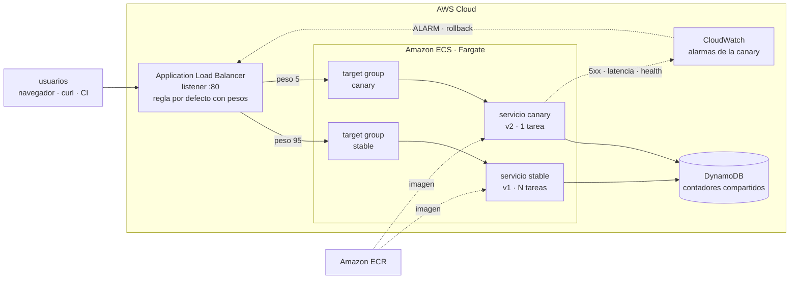

# ECS Canary in Action

Laboratorio de **despliegues canary en Amazon ECS Fargate**. La app que se
despliega funciona además como **monitor de tráfico en vivo**: en el navegador
ves cómo se reparten las peticiones entre la versión estable y la canary,
mientras movés los pesos del balanceador.


```
BUILD · DEPLOY · EVOLVE
```

---

## Qué vas a practicar

- Repartir tráfico real con **weighted target groups** de un ALB (95/5, 50/50, 100/0).
- Ver la distribución **en vivo**, comparando lo que pediste con lo que realmente pasa.
- **Simular un incidente de forma controlada** y ver cómo las alarmas de
  CloudWatch disparan el **rollback automático**.
- Encadenarlo en **CI/CD con GitHub Actions**, usando OIDC (sin claves de acceso).

---

## Arquitectura



El único elemento que mueve tráfico es la regla por defecto del listener. Las
dos versiones corren siempre; lo que cambia es el peso que reciben. Eso hace que
el rollback sea instantáneo (reescribir dos números) y que las dos versiones
sean observables al mismo tiempo con tráfico real.

---

## Requisitos

| Herramienta | Para qué |
|---|---|
| `aws` CLI v2 | todo lo de AWS |
| `jq` | los scripts parsean JSON |
| `docker` | construir la imagen y el laboratorio local |
| `terraform` 1.6+ | desplegar en AWS |
| `node` 20+ | el modo dev (`make dev`) |
| `trivy` | análisis de seguridad de la infraestructura (`make lint-trivy`) |

```bash
brew install awscli jq terraform trivy   # macOS
```

En AWS necesitás permisos para crear ALB, ECS, ECR, DynamoDB, CloudWatch y roles
IAM.

Si trabajás con un asistente de IA sobre este repo, `.kiro/settings/mcp.json`
configura el [servidor MCP oficial de Terraform](https://developer.hashicorp.com/terraform/mcp-server)
(HashiCorp, corre en Docker, sin token), para que el asistente consulte la
documentación más reciente de providers y módulos del registro público.

---

## 1. Correr local, sin cuenta de AWS

Levanta un ALB de juguete (`local/mini-alb`) que imita el real: pesos, routing
forzado, health checks y 503 cuando no hay targets sanos.

```bash
make local
open http://localhost:8080
```

| URL | Qué es |
|---|---|
| http://localhost:8080 | el dashboard, detrás del balanceador |
| http://localhost:8081 | la versión estable, directo |
| http://localhost:8082 | la versión canary, directo |

Mueve el tráfico y mirá el dashboard reaccionar:

```bash
./scripts/weights.sh --target local --canary 5     # 5% a la canary
./scripts/weights.sh --target local --canary 50    # mitad y mitad

./scripts/traffic-gen.sh --url http://localhost:8080 --requests 200
#   stable     190 requests (95%)
#   canary     10 requests (5%)

./scripts/chaos.sh --url http://localhost:8080 --break   # inyecta fallos en la canary
./scripts/chaos.sh --url http://localhost:8080 --clear   # desactiva la inyección de fallos

make local-down
```

Es exactamente el flujo que corre en CI en cada pull request.

---

## 2. Desplegar en AWS con Terraform

```bash
cd infra/terraform
terraform init
terraform apply
cd ../..

./scripts/load-env.sh
make push TAG=v1
```

### Qué crea `terraform apply`

- **Red**: si dejás `vpc_id` vacío (default), crea una VPC mínima solo para el
  laboratorio: subnets públicas + internet gateway. Si pasás `vpc_id` y
  `public_subnet_ids` en `terraform.tfvars`, no crea nada de red y usa la tuya.
- **ALB** con dos target groups (`stable`, `canary`) y un listener con regla
  ponderada por defecto, más reglas de routing forzado (`?track=`, header
  `X-Canary`).
- **ECS Fargate**: un cluster, dos servicios (`stable` con 2 tareas, `canary`
  con 0 hasta que arranca un rollout), sus task definitions y roles IAM.
- **DynamoDB**: una tabla para los contadores de tráfico que ve el dashboard.
- **CloudWatch**: 4 alarmas sobre el target group de la canary (5xx, latencia
  p95, targets no sanos, tasa de error de la app) y un dashboard
  (`<proyecto>-canary`) con un widget de porcentaje de tráfico calculado con
  metric math.
- **ECR**: el repositorio de la imagen (`build-push.sh` lo crea si no existe;
  con `create_ecr_repository = true` lo maneja Terraform).

`./scripts/load-env.sh` traduce las salidas de Terraform a `.canary.env`, que el
resto de los scripts lee. Volvé a correrlo después de cada `apply`.

Para usar tu propia VPC en vez de que Terraform cree una:

```bash
aws ec2 describe-vpcs --query 'Vpcs[].{Id:VpcId,Cidr:CidrBlock}'
aws ec2 describe-subnets --filters Name=vpc-id,Values=<tu-vpc-id> \
  --query 'Subnets[].{Id:SubnetId,Az:AvailabilityZone,Public:MapPublicIpOnLaunch}'
# o: ./scripts/discover-vpc.sh --format tfvars

cp infra/terraform/terraform.tfvars.example infra/terraform/terraform.tfvars
# descomentá vpc_id y public_subnet_ids
```

Los pesos del listener y el `desired_count` de la canary están protegidos con
`ignore_changes`, así que un `terraform apply` a mitad de un rollout no te pisa
el reparto de tráfico.

---

## El dashboard

La app se sirve a sí misma y se mide a sí misma: manda solicitudes de prueba a
`/api/hit` desde tu navegador, así que la distribución que ves es tráfico real
pasando por el balanceador.

| Barra | Qué significa |
|---|---|
| **Distribución configurada (ALB)** | los pesos del listener, leídos en vivo |
| **Distribución observada (cliente)** | lo que le está pasando a tu navegador |
| **Distribución global (todas las tareas)** | lo que le pasa a todo el mundo, contado en DynamoDB |

Con pocas peticiones las tres difieren; al subir el ritmo convergen: los pesos
son probabilidad, no una distribución exacta.

Para ver una versión concreta sin tocar los pesos:

```bash
curl "http://$ALB/?track=canary"          # por query string
curl -H 'X-Canary: always' "http://$ALB/" # por header
```

El mismo número (porcentaje de tráfico de la canary) también está en
CloudWatch: `terraform output cloudwatch_dashboard_url`.

---

## Demo A: el rollout que sale bien

```bash
make push TAG=v2
./scripts/canary-deploy.sh --tag v2
```

1. Registra una task definition de la canary con la imagen nueva.
2. Escala el servicio canary y espera targets sanos de verdad.
3. Limpia el estado viejo de las alarmas.
4. Mueve los pesos **5% → 25% → 50% → 100%**, horneando 90 segundos entre paso
   y paso mientras vigila las alarmas.
5. Si todo está en orden, promueve: la estable pasa a la imagen nueva, el
   tráfico vuelve a 100% estable y la canary baja a cero.

Si una alarma salta en cualquier momento, el script revierte solo y termina con
error. Mientras corre, en otra terminal:

```bash
make watch
./scripts/traffic-gen.sh --rps 15 --duration 300
```

## Demo B: el rollback automático

```bash
# Terminal 1
make watch

# Terminal 2
./scripts/weights.sh --canary 25
./scripts/chaos.sh --break   # inyecta 50% de 5xx y 1200 ms extra, solo en la canary
```

En un par de minutos las alarmas pasan a `ALARM`, y si tenías un rollout
corriendo, vuelve el tráfico a la estable solo.

A mano:

```bash
./scripts/rollback.sh       # tráfico a 100% estable, ya
./scripts/chaos.sh --clear  # desactiva la inyección de fallos
```

---

## Comandos

```bash
make help
```

| Comando | Qué hace |
|---|---|
| `make local` / `make local-down` | laboratorio local con docker compose |
| `make push TAG=v2` | construye y sube la imagen |
| `make status` / `make watch` | estado del despliegue |
| `make canary TAG=v2` | rollout progresivo con rollback automático |
| `make weights CANARY=25` | mueve el tráfico a mano |
| `make traffic RPS=20` | genera carga y reporta el reparto observado |
| `make break` / `make fix` | inyecta y limpia fallos |
| `make rollback` | todo el tráfico a la estable |
| `make promote TAG=v2` | promueve una versión a estable |
| `make lint` | shellcheck, terraform fmt/validate, node, Trivy |
| `make clean` | borra artefactos locales y `.canary.env` |

Cada script acepta `--help`.

---

## Qué se prueba

**`app/scripts/smoke.js`** — corre contra cualquier instancia de la app (local o
en un contenedor) y verifica: `/api/health`, `/api/config`, que `/api/hit`
registre tráfico e identifique la versión, que `/api/stats` agregue los
contadores, un ciclo completo de inyección de fallos (falla al 100% y se
recupera), `/metrics` y que el dashboard se sirva.

**`.github/workflows/ci.yml`**, en cada push y PR, sin credenciales de AWS:

- `lint`: sintaxis de JS, shellcheck, `terraform fmt`/`validate`, Trivy.
- `container`: construye la imagen real, la corre, espera que reporte sana y le
  corre el smoke test.
- `integration`, el flujo canary completo contra el laboratorio local:
  - ambas versiones responden cuando se las direcciona explícitamente;
  - al 100/0 todo el tráfico va a la estable, cero errores;
  - al 50/50 la distribución observada cae entre 30% y 70% de canary;
  - inyectar fallos en la canary produce 5xx solo ahí, la estable no se afecta;
  - una canary marcada `unhealthy` sale de rotación **y el servicio sigue
    respondiendo al 100% desde la estable**, que es la propiedad de seguridad
    que todo este laboratorio demuestra;
  - limpiar la inyección de fallos recupera la canary.

---

## Costos

Estimación en `us-east-1` con la configuración por defecto (2 tareas estables de
0.25 vCPU, ALB, DynamoDB on-demand, 4 alarmas):

| Recurso | Aproximado |
|---|---|
| Application Load Balancer | USD 0,023 / hora |
| Fargate, 2 tareas | USD 0,025 / hora |
| DynamoDB, CloudWatch, logs | centavos con tráfico de laboratorio |
| **Total** | **≈ USD 0,05 / hora, ≈ USD 35 / mes** |

El ALB cobra aunque no haya tráfico. **Destruí el laboratorio cuando termines:**

```bash
cd infra/terraform && terraform destroy
```

Si `build-push.sh` creó el repositorio de ECR (el flujo por defecto), borralo
aparte:

```bash
aws ecr delete-repository --repository-name canary-lab-app --force
```

---

## Seguridad: lee esto antes de dejarlo encendido

Este repositorio es material didáctico y sus valores por defecto priorizan que
puedas compartir el dashboard con tu audiencia:

- **El ALB escucha en HTTP y acepta `0.0.0.0/0`.** Limitalo a tu IP con
  `allowed_ingress_cidrs = ["TU.IP/32"]`. Para algo serio, pon HTTPS con ACM.
- **`/api/chaos` y `/api/reset` no piden autenticación.** Cualquiera que llegue
  al ALB puede romper tu canary. Define `admin_token` en `terraform.tfvars` y
  los endpoints van a exigir la cabecera `X-Admin-Token`.
- **El token viaja como variable de entorno de la task definition**, visible en
  la consola. Para un secreto real, usa Secrets Manager.
- Las tareas salen a internet con IP pública para poder bajar la imagen sin NAT
  gateway. Es lo más barato, no lo más aislado.

`make lint-trivy` corre [Trivy](https://trivy.dev) (sucesor de tfsec) contra el
Terraform. Los hallazgos de arriba están suprimidos inline en los `.tf` con
comentarios `#trivy:ignore` y su justificación.

---

## Si algo no funciona

| Síntoma | Causa probable |
|---|---|
| Las tareas arrancan y mueren en bucle | la imagen no existe con ese tag, o se construyó para `arm64` con el stack esperando `X86_64` |
| `503` desde el ALB | no hay targets sanos. `./scripts/status.sh` y mirá `healthy=` |
| El dashboard dice "dynamodb (degradado)" | la tabla no existe o al rol de la tarea le falta permiso |
| El peso del ALB sale como "estimado" | falta `LISTENER_ARN` o el permiso `elasticloadbalancing:DescribeRules` |
| `missing environment: CANARY_...` | falta `.canary.env`. Corré `./scripts/load-env.sh` |
| El rollout revierte enseguida | había una alarma en `ALARM` de una demo anterior; se limpia salvo `--no-reset-alarms` |

```bash
aws logs tail /ecs/canary-lab --since 15m --follow
```

---

## Estructura

```
app/                  la aplicación y el dashboard (Node, sin build step)
  src/                servidor, store de DynamoDB, inyección de fallos, métricas EMF
  public/             dashboard: HTML, CSS y JS a mano, sin dependencias
infra/terraform/       la infraestructura
scripts/              el flujo canary: weights, canary-deploy, rollback, chaos...
local/                laboratorio sin AWS: mini-alb + docker compose
docs/                 arquitectura a fondo y runbook de operación
.github/workflows/    CI y CD
```

Más detalle en [docs/architecture.md](docs/architecture.md) y el runbook en
[docs/canary-playbook.md](docs/canary-playbook.md).

---

## Licencia

MIT. Úsalo en tus charlas, cursos y workshops.
