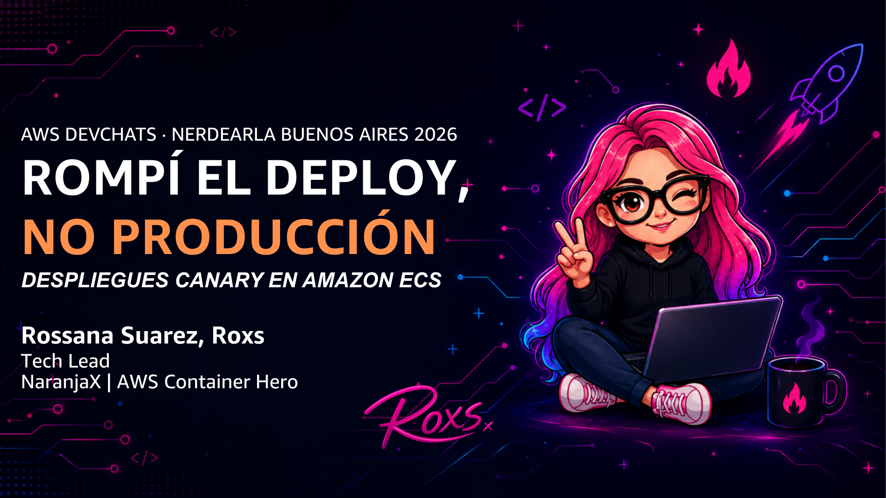
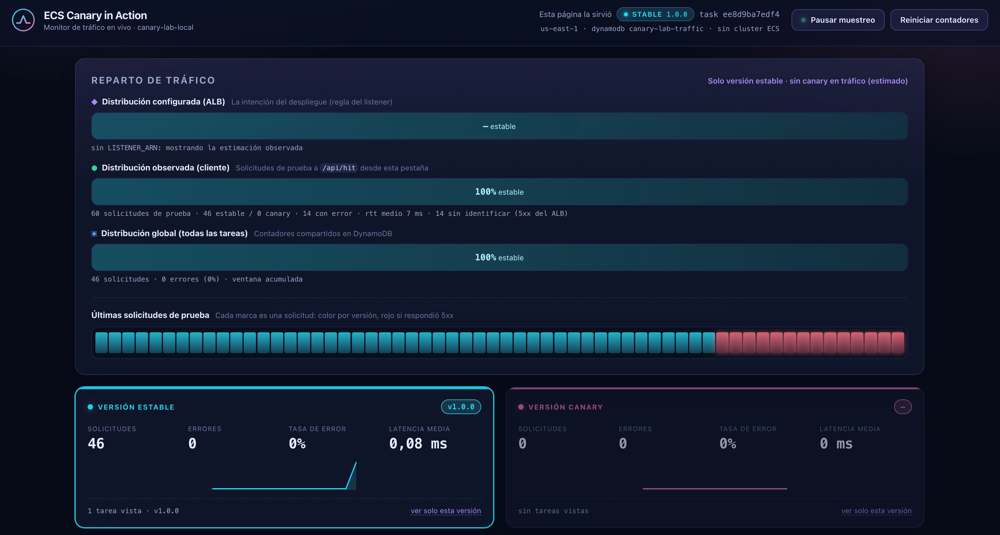
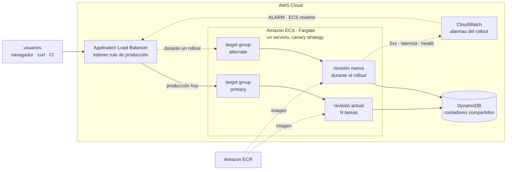
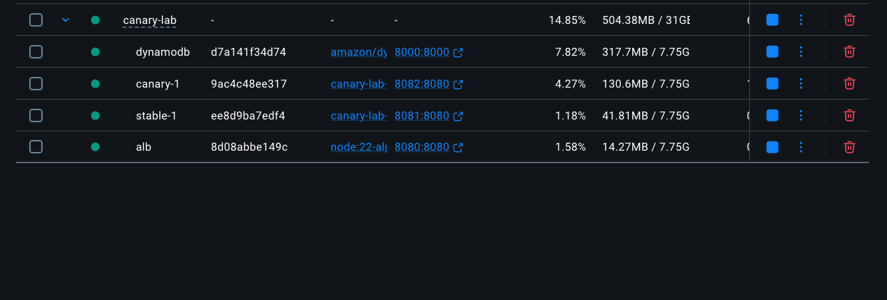
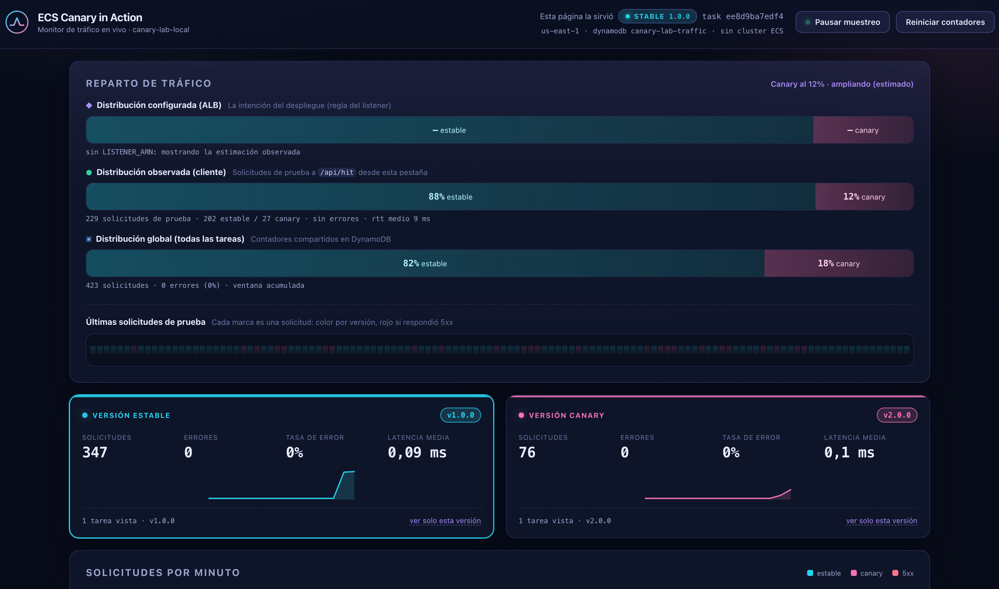

# ECS Canary in Action

Laboratorio de **despliegues canary en Amazon ECS Fargate**. En AWS usa la
estrategia de canary nativa de ECS (lanzada en 2025): un solo servicio, y ECS
mismo mueve el tráfico, hornea y revierte si algo sale mal. En local, un
balanceador de juguete con dos versiones enseña el mecanismo de pesos paso a
paso, sin la orquestación por delante. La app que se despliega funciona
además como **monitor de tráfico en vivo**.

[](https://github.com/roxsross/aws-ecs-canary-in-action/actions/workflows/ci.yml)
[](https://github.com/roxsross/aws-ecs-canary-in-action/actions/workflows/infra-terraform.yml)
[](infra/terraform)
[](app/package.json)
[](infra/terraform)
[](https://trivy.dev)
[](LICENSE)



## Qué vas a practicar

- Un rollout canary **orquestado por ECS**: crea la revisión nueva, hornea con
  un porcentaje chico de tráfico y promueve el resto solo, sin scripts que
  muevan pesos a mano.
- Ver la distribución **en vivo**, comparando la revisión nueva contra la actual.
- **Simular un incidente de forma controlada** y ver cómo las alarmas de
  CloudWatch disparan el **rollback automático**, sin intervención humana.
- El mecanismo de pesos explícito, en el laboratorio local, antes de delegarlo
  a la orquestación de ECS.
- Todo esto en **CI/CD con GitHub Actions**, usando OIDC (sin claves de acceso).



## Arquitectura



ECS mueve el tráfico él mismo durante un rollout: crea la revisión nueva,
la registra en el target group `alternate`, hornea con un porcentaje chico de
tráfico vigilando las alarmas, y si todo va bien mueve el resto y termina la
revisión vieja. Si una alarma dispara, revierte solo. El laboratorio local usa
un mecanismo más simple y explícito (pesos a mano) para enseñar la idea antes
de delegarla a ECS — ver [docs/architecture.md](docs/architecture.md).

## Requisitos

| Herramienta | Para qué |
|---|---|
| `aws` CLI v2 | todo lo de AWS |
| `jq` | los scripts parsean JSON |
| `docker` | construir la imagen y el laboratorio local |
| `terraform` 1.6+ | desplegar en AWS |
| `node` 20+ | el modo dev (`make dev`) |
| `trivy` | análisis de seguridad de la infraestructura (`make lint-trivy`) |

En AWS necesitás permisos para crear ALB, ECS, ECR, DynamoDB, CloudWatch y roles
IAM.

Si trabajás con un asistente de IA sobre este repo, `.kiro/settings/mcp.json`
configura el [servidor MCP oficial de Terraform](https://developer.hashicorp.com/terraform/mcp-server)
(HashiCorp, corre en Docker, sin token), para que el asistente consulte la
documentación más reciente de providers y módulos del registro público.

## Quickstart 1: local, sin cuenta de AWS

`make local` levanta con `docker compose` el mismo laboratorio, sin AWS:

- **mini-alb** (`local/mini-alb/server.js`): un balanceador de juguete que
  imita al ALB real — reparte tráfico por peso, expone routing forzado y
  devuelve 503 cuando no hay targets sanos.
- **stable** y **canary**: dos contenedores de la misma app (`app/`), cada uno
  con su `TRACK`/`APP_VERSION`, igual que los dos servicios ECS reales.
- **dynamodb-local**: la misma tabla de contadores que en AWS, pero en memoria
  y sin costo.

Es la misma arquitectura del diagrama de arriba a escala de laptop, y es
exactamente el flujo que corre en CI en cada pull request.

```bash
make local
open http://localhost:8080
```



| URL | Qué es |
|---|---|
| http://localhost:8080 | el dashboard, detrás del balanceador |
| http://localhost:8081 | la versión estable, directo |
| http://localhost:8082 | la versión canary, directo |

Mueve el tráfico y mirá el dashboard reaccionar:

```bash
./scripts/weights.sh --target local --canary 25
./scripts/traffic-gen.sh --url http://localhost:8080 --requests 200
./scripts/chaos.sh --url http://localhost:8080 --break   # inyecta fallos en la canary
./scripts/chaos.sh --url http://localhost:8080 --clear

make local-down
```



## Quickstart 2: desplegar en AWS con Terraform

```bash
cd infra/terraform
terraform init
terraform apply
cd ../..

./scripts/load-env.sh
make push TAG=v1
```

`terraform apply` crea toda la infraestructura del diagrama de arriba: la red
(o referencia la tuya, ver abajo), el ALB con sus target groups `primary`/
`alternate`, el cluster ECS con un servicio configurado con la estrategia de
canary nativa (`deployment_configuration`), la tabla de DynamoDB, las 4 alarmas
de CloudWatch y su dashboard, y el repositorio de ECR. `make push` construye la
imagen (multi-arquitectura, amd64+arm64, así corre en Fargate sin importar
`cpu_architecture` ni en qué máquina se compiló) y la sube.

Por defecto, `vpc_id` queda vacío y Terraform crea una VPC mínima solo para el
laboratorio. Si ya tenés una VPC y preferís usarla:

```bash
aws ec2 describe-vpcs --query 'Vpcs[].{Id:VpcId,Cidr:CidrBlock}'
aws ec2 describe-subnets --filters Name=vpc-id,Values=<tu-vpc-id> \
  --query 'Subnets[].{Id:SubnetId,Az:AvailabilityZone,Public:MapPublicIpOnLaunch}'

cp infra/terraform/terraform.tfvars.example infra/terraform/terraform.tfvars
# completá vpc_id y public_subnet_ids con lo que devolvió describe-subnets
```

Con `vpc_id` seteado, Terraform no crea nada de red y usa la tuya.

### Siguientes pasos

Con el `apply` y el primer `push` hechos, el servicio ya está sirviendo
tráfico real:

```bash
make status                                                      # rollout, targets, alarmas
open "$(terraform -chdir=infra/terraform output -raw app_url)"   # el dashboard
```

Si `make status` no muestra targets sanos todavía, dale unos segundos: el
health check del target group tarda un par de ciclos en confirmarlo.

De acá en más, el flujo es hacer un rollout de una versión nueva (`make push
TAG=v2` + `./scripts/canary-deploy.sh --tag v2`, y ECS se encarga del resto) o
simular un incidente durante el rollout y ver el rollback automático
(`./scripts/chaos.sh --break`) — guionado paso a paso en
[docs/canary-playbook.md](docs/canary-playbook.md).

## Seguir leyendo

- **[docs/ejemplo-canary.md](docs/ejemplo-canary.md)** — recorrido guiado de
  punta a punta: levantar la estable, meter la canary e inyectarle latencia,
  primero en local y después en AWS con Terraform.
- **[docs/canary-playbook.md](docs/canary-playbook.md)** — runbook operativo:
  cómo correr y leer un rollout, qué hacer cuando algo sale mal, el guion de una
  demo en vivo, y qué ajustar para producción.
- **[docs/architecture.md](docs/architecture.md)** — arquitectura a fondo: el
  mecanismo de pesos del ALB, el modelo de datos en DynamoDB, las alarmas y el
  dashboard de CloudWatch, seguridad y permisos.
- **[docs/operations.md](docs/operations.md)** — referencia de comandos,
  cómo correr las pruebas y ver sus resultados, troubleshooting de setup,
  estructura completa del repo, seguridad y limpieza (`terraform destroy`).

## Licencia

MIT. Úsalo en tus charlas, cursos y workshops.
